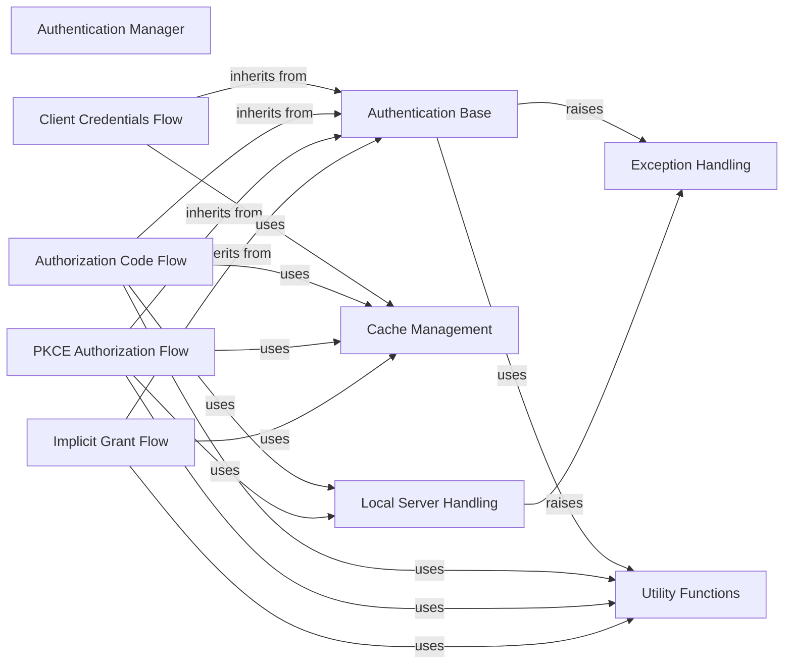

## Component Details

The Authentication Manager subsystem in Spotipy is responsible for handling all aspects of OAuth 2.0 authentication flows, including Client Credentials, Authorization Code, PKCE, and Implicit Grant. Its primary purpose is to acquire, validate, and refresh access tokens, which are essential for interacting with the Spotify API. The system is built upon a foundational 'Authentication Base' component that provides common functionalities, with specialized components for each OAuth flow. It integrates with cache management for token persistence, local server handling for redirect URI capture, and robust exception handling for error management. Utility functions support various helper operations across the authentication process.

### Authentication Manager
Manages all OAuth 2.0 authentication flows (Client Credentials, Authorization Code, PKCE, Implicit Grant) and handles token acquisition, validation, and refreshing. It provides the necessary access tokens for the Spotify API Client.

**Related Classes/Methods**:

- <a href="https://github.com/spotipy-dev/spotipy/blob/master/spotipy/oauth2.py#L46-L127" target="_blank" rel="noopener noreferrer">`spotipy.spotipy.oauth2.SpotifyAuthBase` (46:127)</a>
- <a href="https://github.com/spotipy-dev/spotipy/blob/master/spotipy/oauth2.py#L130-L245" target="_blank" rel="noopener noreferrer">`spotipy.spotipy.oauth2.SpotifyClientCredentials` (130:245)</a>
- <a href="https://github.com/spotipy-dev/spotipy/blob/master/spotipy/oauth2.py#L248-L603" target="_blank" rel="noopener noreferrer">`spotipy.spotipy.oauth2.SpotifyOAuth` (248:603)</a>
- <a href="https://github.com/spotipy-dev/spotipy/blob/master/spotipy/oauth2.py#L606-L972" target="_blank" rel="noopener noreferrer">`spotipy.spotipy.oauth2.SpotifyPKCE` (606:972)</a>
- <a href="https://github.com/spotipy-dev/spotipy/blob/master/spotipy/oauth2.py#L975-L1235" target="_blank" rel="noopener noreferrer">`spotipy.spotipy.oauth2.SpotifyImplicitGrant` (975:1235)</a>

### Authentication Base
Provides the foundational functionalities for all Spotify OAuth 2.0 authentication flows. This includes handling client credentials, redirect URIs, checking token expiration, normalizing scopes, and generic OAuth error handling.

**Related Classes/Methods**:

- <a href="https://github.com/spotipy-dev/spotipy/blob/master/spotipy/oauth2.py#L46-L127" target="_blank" rel="noopener noreferrer">`spotipy.spotipy.oauth2.SpotifyAuthBase` (46:127)</a>
- <a href="https://github.com/spotipy-dev/spotipy/blob/master/spotipy/oauth2.py#L37-L43" target="_blank" rel="noopener noreferrer">`spotipy.spotipy.oauth2:_ensure_value` (37:43)</a>
- <a href="https://github.com/spotipy-dev/spotipy/blob/master/spotipy/oauth2.py#L30-L34" target="_blank" rel="noopener noreferrer">`spotipy.spotipy.oauth2:_make_authorization_headers` (30:34)</a>
- <a href="https://github.com/spotipy-dev/spotipy/blob/master/spotipy/oauth2.py#L61-L62" target="_blank" rel="noopener noreferrer">`spotipy.spotipy.oauth2.SpotifyAuthBase:client_id` (61:62)</a>
- <a href="https://github.com/spotipy-dev/spotipy/blob/master/spotipy/oauth2.py#L69-L70" target="_blank" rel="noopener noreferrer">`spotipy.spotipy.oauth2.SpotifyAuthBase:client_secret` (69:70)</a>
- <a href="https://github.com/spotipy-dev/spotipy/blob/master/spotipy/oauth2.py#L77-L78" target="_blank" rel="noopener noreferrer">`spotipy.spotipy.oauth2.SpotifyAuthBase:redirect_uri` (77:78)</a>
- <a href="https://github.com/spotipy-dev/spotipy/blob/master/spotipy/oauth2.py#L57-L58" target="_blank" rel="noopener noreferrer">`spotipy.spotipy.oauth2.SpotifyAuthBase:_normalize_scope` (57:58)</a>
- <a href="https://github.com/spotipy-dev/spotipy/blob/master/spotipy/oauth2.py#L92-L94" target="_blank" rel="noopener noreferrer">`spotipy.spotipy.oauth2.SpotifyAuthBase:is_token_expired` (92:94)</a>
- <a href="https://github.com/spotipy-dev/spotipy/blob/master/spotipy/oauth2.py#L97-L102" target="_blank" rel="noopener noreferrer">`spotipy.spotipy.oauth2.SpotifyAuthBase:_is_scope_subset` (97:102)</a>
- <a href="https://github.com/spotipy-dev/spotipy/blob/master/spotipy/oauth2.py#L104-L122" target="_blank" rel="noopener noreferrer">`spotipy.spotipy.oauth2.SpotifyAuthBase:_handle_oauth_error` (104:122)</a>

### Client Credentials Flow
Manages the Client Credentials Grant flow, which is used for server-to-server authentication where no user context is required. It obtains application-level access tokens.

**Related Classes/Methods**:

- <a href="https://github.com/spotipy-dev/spotipy/blob/master/spotipy/oauth2.py#L130-L245" target="_blank" rel="noopener noreferrer">`spotipy.spotipy.oauth2.SpotifyClientCredentials` (130:245)</a>
- <a href="https://github.com/spotipy-dev/spotipy/blob/master/spotipy/oauth2.py#L133-L181" target="_blank" rel="noopener noreferrer">`spotipy.spotipy.oauth2.SpotifyClientCredentials:__init__` (133:181)</a>
- <a href="https://github.com/spotipy-dev/spotipy/blob/master/spotipy/oauth2.py#L183-L211" target="_blank" rel="noopener noreferrer">`spotipy.spotipy.oauth2.SpotifyClientCredentials:get_access_token` (183:211)</a>
- <a href="https://github.com/spotipy-dev/spotipy/blob/master/spotipy/oauth2.py#L213-L237" target="_blank" rel="noopener noreferrer">`spotipy.spotipy.oauth2.SpotifyClientCredentials:_request_access_token` (213:237)</a>
- <a href="https://github.com/spotipy-dev/spotipy/blob/master/spotipy/oauth2.py#L239-L245" target="_blank" rel="noopener noreferrer">`spotipy.spotipy.oauth2.SpotifyClientCredentials:_add_custom_values_to_token_info` (239:245)</a>

### Authorization Code Flow
Implements the standard Authorization Code Grant flow, which requires user interaction to authorize the application and exchange an authorization code for access and refresh tokens.

**Related Classes/Methods**:

- <a href="https://github.com/spotipy-dev/spotipy/blob/master/spotipy/oauth2.py#L248-L603" target="_blank" rel="noopener noreferrer">`spotipy.spotipy.oauth2.SpotifyOAuth` (248:603)</a>
- <a href="https://github.com/spotipy-dev/spotipy/blob/master/spotipy/oauth2.py#L255-L335" target="_blank" rel="noopener noreferrer">`spotipy.spotipy.oauth2.SpotifyOAuth:__init__` (255:335)</a>
- <a href="https://github.com/spotipy-dev/spotipy/blob/master/spotipy/oauth2.py#L337-L352" target="_blank" rel="noopener noreferrer">`spotipy.spotipy.oauth2.SpotifyOAuth:validate_token` (337:352)</a>
- <a href="https://github.com/spotipy-dev/spotipy/blob/master/spotipy/oauth2.py#L375-L385" target="_blank" rel="noopener noreferrer">`spotipy.spotipy.oauth2.SpotifyOAuth:parse_response_code` (375:385)</a>
- <a href="https://github.com/spotipy-dev/spotipy/blob/master/spotipy/oauth2.py#L388-L394" target="_blank" rel="noopener noreferrer">`spotipy.spotipy.oauth2.SpotifyOAuth:parse_auth_response_url` (388:394)</a>
- <a href="https://github.com/spotipy-dev/spotipy/blob/master/spotipy/oauth2.py#L396-L397" target="_blank" rel="noopener noreferrer">`spotipy.spotipy.oauth2.SpotifyOAuth:_make_authorization_headers` (396:397)</a>
- <a href="https://github.com/spotipy-dev/spotipy/blob/master/spotipy/oauth2.py#L399-L405" target="_blank" rel="noopener noreferrer">`spotipy.spotipy.oauth2.SpotifyOAuth:_open_auth_url` (399:405)</a>
- <a href="https://github.com/spotipy-dev/spotipy/blob/master/spotipy/oauth2.py#L407-L421" target="_blank" rel="noopener noreferrer">`spotipy.spotipy.oauth2.SpotifyOAuth:_get_auth_response_interactive` (407:421)</a>
- <a href="https://github.com/spotipy-dev/spotipy/blob/master/spotipy/oauth2.py#L423-L435" target="_blank" rel="noopener noreferrer">`spotipy.spotipy.oauth2.SpotifyOAuth:_get_auth_response_local_server` (423:435)</a>
- <a href="https://github.com/spotipy-dev/spotipy/blob/master/spotipy/oauth2.py#L437-L476" target="_blank" rel="noopener noreferrer">`spotipy.spotipy.oauth2.SpotifyOAuth:get_auth_response` (437:476)</a>
- <a href="https://github.com/spotipy-dev/spotipy/blob/master/spotipy/oauth2.py#L478-L481" target="_blank" rel="noopener noreferrer">`spotipy.spotipy.oauth2.SpotifyOAuth:get_authorization_code` (478:481)</a>
- <a href="https://github.com/spotipy-dev/spotipy/blob/master/spotipy/oauth2.py#L483-L540" target="_blank" rel="noopener noreferrer">`spotipy.spotipy.oauth2.SpotifyOAuth:get_access_token` (483:540)</a>
- <a href="https://github.com/spotipy-dev/spotipy/blob/master/spotipy/oauth2.py#L542-L569" target="_blank" rel="noopener noreferrer">`spotipy.spotipy.oauth2.SpotifyOAuth:refresh_access_token` (542:569)</a>
- <a href="https://github.com/spotipy-dev/spotipy/blob/master/spotipy/oauth2.py#L580-L593" target="_blank" rel="noopener noreferrer">`spotipy.spotipy.oauth2.SpotifyOAuth:get_cached_token` (580:593)</a>

### PKCE Authorization Flow
Implements the Authorization Code Grant with Proof Key for Code Exchange (PKCE) flow, a more secure method for public clients (e.g., mobile or desktop apps) that cannot securely store a client secret. It involves generating a code verifier and challenge.

**Related Classes/Methods**:

- <a href="https://github.com/spotipy-dev/spotipy/blob/master/spotipy/oauth2.py#L606-L972" target="_blank" rel="noopener noreferrer">`spotipy.spotipy.oauth2.SpotifyPKCE` (606:972)</a>
- <a href="https://github.com/spotipy-dev/spotipy/blob/master/spotipy/oauth2.py#L621-L695" target="_blank" rel="noopener noreferrer">`spotipy.spotipy.oauth2.SpotifyPKCE:__init__` (621:695)</a>
- <a href="https://github.com/spotipy-dev/spotipy/blob/master/spotipy/oauth2.py#L722-L740" target="_blank" rel="noopener noreferrer">`spotipy.spotipy.oauth2.SpotifyPKCE:get_authorize_url` (722:740)</a>
- <a href="https://github.com/spotipy-dev/spotipy/blob/master/spotipy/oauth2.py#L742-L748" target="_blank" rel="noopener noreferrer">`spotipy.spotipy.oauth2.SpotifyPKCE:_open_auth_url` (742:748)</a>
- <a href="https://github.com/spotipy-dev/spotipy/blob/master/spotipy/oauth2.py#L750-L788" target="_blank" rel="noopener noreferrer">`spotipy.spotipy.oauth2.SpotifyPKCE:_get_auth_response` (750:788)</a>
- <a href="https://github.com/spotipy-dev/spotipy/blob/master/spotipy/oauth2.py#L790-L803" target="_blank" rel="noopener noreferrer">`spotipy.spotipy.oauth2.SpotifyPKCE:_get_auth_response_local_server` (790:803)</a>
- <a href="https://github.com/spotipy-dev/spotipy/blob/master/spotipy/oauth2.py#L805-L817" target="_blank" rel="noopener noreferrer">`spotipy.spotipy.oauth2.SpotifyPKCE:_get_auth_response_interactive` (805:817)</a>
- <a href="https://github.com/spotipy-dev/spotipy/blob/master/spotipy/oauth2.py#L819-L822" target="_blank" rel="noopener noreferrer">`spotipy.spotipy.oauth2.SpotifyPKCE:get_authorization_code` (819:822)</a>
- <a href="https://github.com/spotipy-dev/spotipy/blob/master/spotipy/oauth2.py#L824-L839" target="_blank" rel="noopener noreferrer">`spotipy.spotipy.oauth2.SpotifyPKCE:validate_token` (824:839)</a>
- <a href="https://github.com/spotipy-dev/spotipy/blob/master/spotipy/oauth2.py#L849-L851" target="_blank" rel="noopener noreferrer">`spotipy.spotipy.oauth2.SpotifyPKCE:get_pkce_handshake_parameters` (849:851)</a>
- <a href="https://github.com/spotipy-dev/spotipy/blob/master/spotipy/oauth2.py#L853-L906" target="_blank" rel="noopener noreferrer">`spotipy.spotipy.oauth2.SpotifyPKCE:get_access_token` (853:906)</a>
- <a href="https://github.com/spotipy-dev/spotipy/blob/master/spotipy/oauth2.py#L908-L936" target="_blank" rel="noopener noreferrer">`spotipy.spotipy.oauth2.SpotifyPKCE:refresh_access_token` (908:936)</a>
- <a href="https://github.com/spotipy-dev/spotipy/blob/master/spotipy/oauth2.py#L938-L948" target="_blank" rel="noopener noreferrer">`spotipy.spotipy.oauth2.SpotifyPKCE:parse_response_code` (938:948)</a>
- <a href="https://github.com/spotipy-dev/spotipy/blob/master/spotipy/oauth2.py#L951-L952" target="_blank" rel="noopener noreferrer">`spotipy.spotipy.oauth2.SpotifyPKCE:parse_auth_response_url` (951:952)</a>
- <a href="https://github.com/spotipy-dev/spotipy/blob/master/spotipy/oauth2.py#L954-L962" target="_blank" rel="noopener noreferrer">`spotipy.spotipy.oauth2.SpotifyPKCE:get_cached_token` (954:962)</a>

### Implicit Grant Flow
Implements the Implicit Grant flow, an older and less recommended method for client-side applications. It directly returns the access token in the URL fragment after authorization.

**Related Classes/Methods**:

- <a href="https://github.com/spotipy-dev/spotipy/blob/master/spotipy/oauth2.py#L975-L1235" target="_blank" rel="noopener noreferrer">`spotipy.spotipy.oauth2.SpotifyImplicitGrant` (975:1235)</a>
- <a href="https://github.com/spotipy-dev/spotipy/blob/master/spotipy/oauth2.py#L1010-L1077" target="_blank" rel="noopener noreferrer">`spotipy.spotipy.oauth2.SpotifyImplicitGrant:__init__` (1010:1077)</a>
- <a href="https://github.com/spotipy-dev/spotipy/blob/master/spotipy/oauth2.py#L1079-L1092" target="_blank" rel="noopener noreferrer">`spotipy.spotipy.oauth2.SpotifyImplicitGrant:validate_token` (1079:1092)</a>
- <a href="https://github.com/spotipy-dev/spotipy/blob/master/spotipy/oauth2.py#L1094-L1118" target="_blank" rel="noopener noreferrer">`spotipy.spotipy.oauth2.SpotifyImplicitGrant:get_access_token` (1094:1118)</a>
- <a href="https://github.com/spotipy-dev/spotipy/blob/master/spotipy/oauth2.py#L1140-L1148" target="_blank" rel="noopener noreferrer">`spotipy.spotipy.oauth2.SpotifyImplicitGrant:parse_response_token` (1140:1148)</a>
- <a href="https://github.com/spotipy-dev/spotipy/blob/master/spotipy/oauth2.py#L1151-L1163" target="_blank" rel="noopener noreferrer">`spotipy.spotipy.oauth2.SpotifyImplicitGrant:parse_auth_response_url` (1151:1163)</a>
- <a href="https://github.com/spotipy-dev/spotipy/blob/master/spotipy/oauth2.py#L1165-L1171" target="_blank" rel="noopener noreferrer">`spotipy.spotipy.oauth2.SpotifyImplicitGrant:_open_auth_url` (1165:1171)</a>
- <a href="https://github.com/spotipy-dev/spotipy/blob/master/spotipy/oauth2.py#L1173-L1200" target="_blank" rel="noopener noreferrer">`spotipy.spotipy.oauth2.SpotifyImplicitGrant:get_auth_response` (1173:1200)</a>
- <a href="https://github.com/spotipy-dev/spotipy/blob/master/spotipy/oauth2.py#L1211-L1225" target="_blank" rel="noopener noreferrer">`spotipy.spotipy.oauth2.SpotifyImplicitGrant:get_cached_token` (1211:1225)</a>

### Cache Management
Provides an abstract interface and a concrete file-based implementation for caching and retrieving Spotify authentication tokens, allowing for token persistence across sessions.

**Related Classes/Methods**:

- <a href="https://github.com/spotipy-dev/spotipy/blob/master/spotipy/cache_handler.py#L22-L43" target="_blank" rel="noopener noreferrer">`spotipy.cache_handler.CacheHandler` (22:43)</a>
- <a href="https://github.com/spotipy-dev/spotipy/blob/master/spotipy/cache_handler.py#L46-L102" target="_blank" rel="noopener noreferrer">`spotipy.cache_handler.CacheFileHandler` (46:102)</a>

### Local Server Handling
Sets up and manages a local HTTP server to capture the redirect URI and extract the authorization code or token during OAuth flows, facilitating automatic authentication.

**Related Classes/Methods**:

- <a href="https://github.com/spotipy-dev/spotipy/blob/master/spotipy/oauth2.py#L1238-L1280" target="_blank" rel="noopener noreferrer">`spotipy.spotipy.oauth2.RequestHandler` (1238:1280)</a>
- <a href="https://github.com/spotipy-dev/spotipy/blob/master/spotipy/oauth2.py#L1239-L1274" target="_blank" rel="noopener noreferrer">`spotipy.spotipy.oauth2.RequestHandler:do_GET` (1239:1274)</a>
- <a href="https://github.com/spotipy-dev/spotipy/blob/master/spotipy/oauth2.py#L1283-L1289" target="_blank" rel="noopener noreferrer">`spotipy.spotipy.oauth2.start_local_http_server` (1283:1289)</a>

### Exception Handling
Defines custom exception classes for OAuth-related errors, providing specific error information for better debugging and error management within the authentication process.

**Related Classes/Methods**:

- <a href="https://github.com/spotipy-dev/spotipy/blob/master/spotipy/exceptions.py#L24-L31" target="_blank" rel="noopener noreferrer">`spotipy.exceptions.SpotifyOauthError` (24:31)</a>
- <a href="https://github.com/spotipy-dev/spotipy/blob/master/spotipy/exceptions.py#L34-L44" target="_blank" rel="noopener noreferrer">`spotipy.exceptions.SpotifyStateError` (34:44)</a>
- <a href="https://github.com/spotipy-dev/spotipy/blob/master/spotipy/exceptions.py#L5-L21" target="_blank" rel="noopener noreferrer">`spotipy.exceptions.SpotifyException` (5:21)</a>

### Utility Functions
Provides various helper functions used across the OAuth subsystem, such as normalizing scopes, parsing host and port from URLs, and prompting for user input.

**Related Classes/Methods**:

- <a href="https://github.com/spotipy-dev/spotipy/blob/master/spotipy/util.py#L136-L157" target="_blank" rel="noopener noreferrer">`spotipy.util.normalize_scope` (136:157)</a>
- <a href="https://github.com/spotipy-dev/spotipy/blob/master/spotipy/util.py#L119-L133" target="_blank" rel="noopener noreferrer">`spotipy.util.get_host_port` (119:133)</a>
- <a href="https://github.com/spotipy-dev/spotipy/blob/master/spotipy/util.py#L30-L116" target="_blank" rel="noopener noreferrer">`spotipy.util.prompt_for_user_token` (30:116)</a>

### [FAQ](https://github.com/CodeBoarding/GeneratedOnBoardings/tree/main?tab=readme-ov-file#faq)