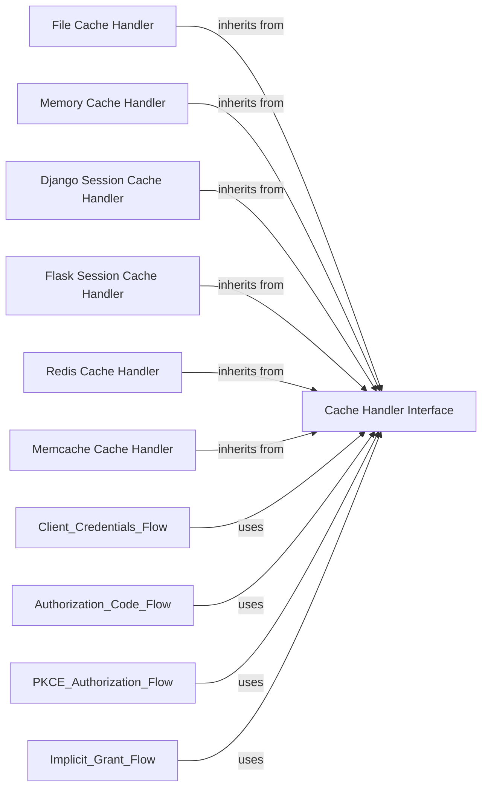

## Component Details

This subsystem provides a flexible mechanism for managing the persistence and retrieval of Spotify authentication tokens. It is built around an abstract `CacheHandler` interface, which defines the contract for caching operations. Various concrete implementations, such as `CacheFileHandler`, `MemoryCacheHandler`, `DjangoSessionCacheHandler`, `FlaskSessionCacheHandler`, `RedisCacheHandler`, and `MemcacheCacheHandler`, extend this interface to support different storage backends. This design allows authentication flows to utilize a consistent caching mechanism regardless of the underlying storage technology, reducing the need for repeated user authentication and improving application performance.

### Cache Handler Interface
Defines the abstract interface for managing the caching and retrieval of Spotify authorization tokens, requiring concrete implementations to provide `get_cached_token` and `save_token_to_cache` methods.

**Related Classes/Methods**:

- <a href="https://github.com/spotipy-dev/spotipy/blob/master/spotipy/cache_handler.py#L22-L43" target="_blank" rel="noopener noreferrer">`spotipy.cache_handler.CacheHandler` (22:43)</a>

### File Cache Handler
Implements the `Cache Handler Interface` by persisting and retrieving authentication tokens as JSON files on the local disk.

**Related Classes/Methods**:

- <a href="https://github.com/spotipy-dev/spotipy/blob/master/spotipy/cache_handler.py#L46-L102" target="_blank" rel="noopener noreferrer">`spotipy.cache_handler.CacheFileHandler` (46:102)</a>
- <a href="https://github.com/spotipy-dev/spotipy/blob/master/spotipy/cache_handler.py#L52-L73" target="_blank" rel="noopener noreferrer">`spotipy.cache_handler.CacheFileHandler.__init__` (52:73)</a>
- <a href="https://github.com/spotipy-dev/spotipy/blob/master/spotipy/cache_handler.py#L75-L91" target="_blank" rel="noopener noreferrer">`spotipy.cache_handler.CacheFileHandler.get_cached_token` (75:91)</a>
- <a href="https://github.com/spotipy-dev/spotipy/blob/master/spotipy/cache_handler.py#L93-L102" target="_blank" rel="noopener noreferrer">`spotipy.cache_handler.CacheFileHandler.save_token_to_cache` (93:102)</a>

### Memory Cache Handler
Implements the `Cache Handler Interface` by storing authentication tokens in memory, which are lost when the instance is freed.

**Related Classes/Methods**:

- <a href="https://github.com/spotipy-dev/spotipy/blob/master/spotipy/cache_handler.py#L105-L123" target="_blank" rel="noopener noreferrer">`spotipy.cache_handler.MemoryCacheHandler` (105:123)</a>
- <a href="https://github.com/spotipy-dev/spotipy/blob/master/spotipy/cache_handler.py#L112-L117" target="_blank" rel="noopener noreferrer">`spotipy.cache_handler.MemoryCacheHandler.__init__` (112:117)</a>
- <a href="https://github.com/spotipy-dev/spotipy/blob/master/spotipy/cache_handler.py#L119-L120" target="_blank" rel="noopener noreferrer">`spotipy.cache_handler.MemoryCacheHandler.get_cached_token` (119:120)</a>
- <a href="https://github.com/spotipy-dev/spotipy/blob/master/spotipy/cache_handler.py#L122-L123" target="_blank" rel="noopener noreferrer">`spotipy.cache_handler.MemoryCacheHandler.save_token_to_cache` (122:123)</a>

### Django Session Cache Handler
Implements the `Cache Handler Interface` by utilizing Django's session framework to store authentication tokens.

**Related Classes/Methods**:

- <a href="https://github.com/spotipy-dev/spotipy/blob/master/spotipy/cache_handler.py#L126-L155" target="_blank" rel="noopener noreferrer">`spotipy.cache_handler.DjangoSessionCacheHandler` (126:155)</a>
- <a href="https://github.com/spotipy-dev/spotipy/blob/master/spotipy/cache_handler.py#L134-L140" target="_blank" rel="noopener noreferrer">`spotipy.cache_handler.DjangoSessionCacheHandler.__init__` (134:140)</a>
- <a href="https://github.com/spotipy-dev/spotipy/blob/master/spotipy/cache_handler.py#L142-L149" target="_blank" rel="noopener noreferrer">`spotipy.cache_handler.DjangoSessionCacheHandler.get_cached_token` (142:149)</a>
- <a href="https://github.com/spotipy-dev/spotipy/blob/master/spotipy/cache_handler.py#L151-L155" target="_blank" rel="noopener noreferrer">`spotipy.cache_handler.DjangoSessionCacheHandler.save_token_to_cache` (151:155)</a>

### Flask Session Cache Handler
Implements the `Cache Handler Interface` by utilizing Flask's session framework to store authentication tokens.

**Related Classes/Methods**:

- <a href="https://github.com/spotipy-dev/spotipy/blob/master/spotipy/cache_handler.py#L158-L180" target="_blank" rel="noopener noreferrer">`spotipy.cache_handler.FlaskSessionCacheHandler` (158:180)</a>
- <a href="https://github.com/spotipy-dev/spotipy/blob/master/spotipy/cache_handler.py#L164-L165" target="_blank" rel="noopener noreferrer">`spotipy.cache_handler.FlaskSessionCacheHandler.__init__` (164:165)</a>
- <a href="https://github.com/spotipy-dev/spotipy/blob/master/spotipy/cache_handler.py#L167-L174" target="_blank" rel="noopener noreferrer">`spotipy.cache_handler.FlaskSessionCacheHandler.get_cached_token` (167:174)</a>
- <a href="https://github.com/spotipy-dev/spotipy/blob/master/spotipy/cache_handler.py#L176-L180" target="_blank" rel="noopener noreferrer">`spotipy.cache_handler.FlaskSessionCacheHandler.save_token_to_cache` (176:180)</a>

### Redis Cache Handler
Implements the `Cache Handler Interface` by storing and retrieving authentication tokens using a Redis database.

**Related Classes/Methods**:

- <a href="https://github.com/spotipy-dev/spotipy/blob/master/spotipy/cache_handler.py#L183-L214" target="_blank" rel="noopener noreferrer">`spotipy.cache_handler.RedisCacheHandler` (183:214)</a>
- <a href="https://github.com/spotipy-dev/spotipy/blob/master/spotipy/cache_handler.py#L188-L197" target="_blank" rel="noopener noreferrer">`spotipy.cache_handler.RedisCacheHandler.__init__` (188:197)</a>
- <a href="https://github.com/spotipy-dev/spotipy/blob/master/spotipy/cache_handler.py#L199-L208" target="_blank" rel="noopener noreferrer">`spotipy.cache_handler.RedisCacheHandler.get_cached_token` (199:208)</a>
- <a href="https://github.com/spotipy-dev/spotipy/blob/master/spotipy/cache_handler.py#L210-L214" target="_blank" rel="noopener noreferrer">`spotipy.cache_handler.RedisCacheHandler.save_token_to_cache` (210:214)</a>

### Memcache Cache Handler
Implements the `Cache Handler Interface` by storing and retrieving authentication tokens using a Memcache server.

**Related Classes/Methods**:

- <a href="https://github.com/spotipy-dev/spotipy/blob/master/spotipy/cache_handler.py#L217-L246" target="_blank" rel="noopener noreferrer">`spotipy.cache_handler.MemcacheCacheHandler` (217:246)</a>
- <a href="https://github.com/spotipy-dev/spotipy/blob/master/spotipy/cache_handler.py#L221-L230" target="_blank" rel="noopener noreferrer">`spotipy.cache_handler.MemcacheCacheHandler.__init__` (221:230)</a>
- <a href="https://github.com/spotipy-dev/spotipy/blob/master/spotipy/cache_handler.py#L232-L239" target="_blank" rel="noopener noreferrer">`spotipy.cache_handler.MemcacheCacheHandler.get_cached_token` (232:239)</a>
- <a href="https://github.com/spotipy-dev/spotipy/blob/master/spotipy/cache_handler.py#L241-L246" target="_blank" rel="noopener noreferrer">`spotipy.cache_handler.MemcacheCacheHandler.save_token_to_cache` (241:246)</a>

### [FAQ](https://github.com/CodeBoarding/GeneratedOnBoardings/tree/main?tab=readme-ov-file#faq)