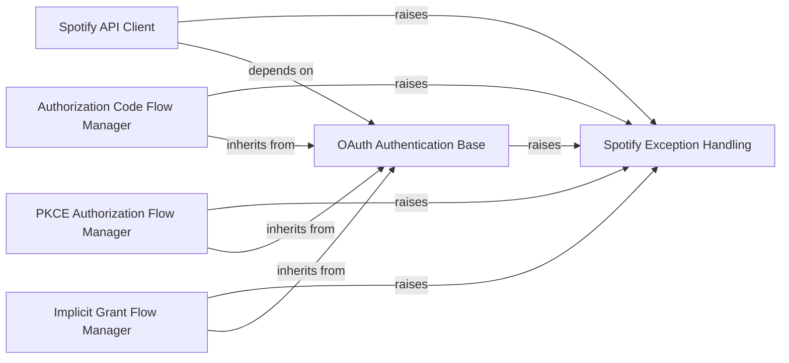

## Component Details

This graph illustrates the core components of the spotipy library, focusing on Spotify API interaction, various OAuth 2.0 authentication flows, and a centralized exception handling mechanism. The Spotify API Client is responsible for direct communication with the Spotify Web API. Authentication flows (Authorization Code, PKCE, and Implicit Grant) manage user authorization and token acquisition, all building upon a common OAuth Authentication Base. A dedicated Spotify Exception Handling component provides structured error reporting across the system, with all major components raising these custom exceptions for robust error management.

### Spotify API Client
This component handles all direct interactions with the Spotify Web API, including making HTTP requests (GET, POST, PUT, DELETE) and processing responses. It also manages retries and timeouts for API calls and handles general Spotify-related exceptions.

**Related Classes/Methods**:

- <a href="https://github.com/spotipy-dev/spotipy/blob/master/spotipy/client.py#L19-L2230" target="_blank" rel="noopener noreferrer">`spotipy.client.Spotify` (19:2230)</a>
- <a href="https://github.com/spotipy-dev/spotipy/blob/master/spotipy/client.py#L243-L315" target="_blank" rel="noopener noreferrer">`spotipy.client.Spotify:_internal_call` (243:315)</a>
- <a href="https://github.com/spotipy-dev/spotipy/blob/master/spotipy/client.py#L2117-L2139" target="_blank" rel="noopener noreferrer">`spotipy.client.Spotify:_get_id` (2117:2139)</a>

### OAuth Authentication Base
This component provides the fundamental mechanisms for Spotify's various OAuth 2.0 authentication flows. It includes common methods for handling client credentials, redirect URIs, scope normalization, and general OAuth error handling.

**Related Classes/Methods**:

- <a href="https://github.com/spotipy-dev/spotipy/blob/master/spotipy/oauth2.py#L46-L127" target="_blank" rel="noopener noreferrer">`spotipy.oauth2.SpotifyAuthBase` (46:127)</a>
- <a href="https://github.com/spotipy-dev/spotipy/blob/master/spotipy/oauth2.py#L37-L43" target="_blank" rel="noopener noreferrer">`spotipy.oauth2:_ensure_value` (37:43)</a>
- <a href="https://github.com/spotipy-dev/spotipy/blob/master/spotipy/oauth2.py#L104-L122" target="_blank" rel="noopener noreferrer">`spotipy.oauth2.SpotifyAuthBase:_handle_oauth_error` (104:122)</a>

### Authorization Code Flow Manager
This component manages the Authorization Code Flow, which is a secure OAuth 2.0 flow suitable for web applications. It handles the generation of authorization URLs, parsing of authentication responses, and obtaining/refreshing access tokens.

**Related Classes/Methods**:

- <a href="https://github.com/spotipy-dev/spotipy/blob/master/spotipy/oauth2.py#L248-L603" target="_blank" rel="noopener noreferrer">`spotipy.oauth2.SpotifyOAuth` (248:603)</a>
- <a href="https://github.com/spotipy-dev/spotipy/blob/master/spotipy/oauth2.py#L388-L394" target="_blank" rel="noopener noreferrer">`spotipy.oauth2.SpotifyOAuth.parse_auth_response_url` (388:394)</a>
- <a href="https://github.com/spotipy-dev/spotipy/blob/master/spotipy/oauth2.py#L407-L421" target="_blank" rel="noopener noreferrer">`spotipy.oauth2.SpotifyOAuth._get_auth_response_interactive` (407:421)</a>
- <a href="https://github.com/spotipy-dev/spotipy/blob/master/spotipy/oauth2.py#L423-L435" target="_blank" rel="noopener noreferrer">`spotipy.oauth2.SpotifyOAuth._get_auth_response_local_server` (423:435)</a>

### PKCE Authorization Flow Manager
This component implements the Authorization Code Flow with Proof Key for Code Exchange (PKCE), a more secure variant of the Authorization Code Flow designed for public clients (e.g., mobile or desktop apps) that cannot securely store a client secret. It handles the generation of code verifiers and challenges.

**Related Classes/Methods**:

- <a href="https://github.com/spotipy-dev/spotipy/blob/master/spotipy/oauth2.py#L606-L972" target="_blank" rel="noopener noreferrer">`spotipy.oauth2.SpotifyPKCE` (606:972)</a>
- <a href="https://github.com/spotipy-dev/spotipy/blob/master/spotipy/oauth2.py#L790-L803" target="_blank" rel="noopener noreferrer">`spotipy.oauth2.SpotifyPKCE._get_auth_response_local_server` (790:803)</a>
- <a href="https://github.com/spotipy-dev/spotipy/blob/master/spotipy/oauth2.py#L805-L817" target="_blank" rel="noopener noreferrer">`spotipy.oauth2.SpotifyPKCE._get_auth_response_interactive` (805:817)</a>

### Implicit Grant Flow Manager
This component manages the Implicit Grant Flow, an older OAuth 2.0 flow primarily for client-side applications. This flow is noted as deprecated due to security concerns and is less recommended than PKCE.

**Related Classes/Methods**:

- <a href="https://github.com/spotipy-dev/spotipy/blob/master/spotipy/oauth2.py#L975-L1235" target="_blank" rel="noopener noreferrer">`spotipy.oauth2.SpotifyImplicitGrant` (975:1235)</a>
- <a href="https://github.com/spotipy-dev/spotipy/blob/master/spotipy/oauth2.py#L1140-L1148" target="_blank" rel="noopener noreferrer">`spotipy.oauth2.SpotifyImplicitGrant.parse_response_token` (1140:1148)</a>
- <a href="https://github.com/spotipy-dev/spotipy/blob/master/spotipy/oauth2.py#L1151-L1163" target="_blank" rel="noopener noreferrer">`spotipy.oauth2.SpotifyImplicitGrant.parse_auth_response_url` (1151:1163)</a>

### Spotify Exception Handling
This component defines a hierarchy of custom exception classes used throughout the spotipy library to signal specific errors related to Spotify API interactions and OAuth processes.

**Related Classes/Methods**:

- <a href="https://github.com/spotipy-dev/spotipy/blob/master/spotipy/exceptions.py#L1-L2" target="_blank" rel="noopener noreferrer">`spotipy.exceptions.SpotifyBaseException` (1:2)</a>
- <a href="https://github.com/spotipy-dev/spotipy/blob/master/spotipy/exceptions.py#L5-L21" target="_blank" rel="noopener noreferrer">`spotipy.exceptions.SpotifyException` (5:21)</a>
- <a href="https://github.com/spotipy-dev/spotipy/blob/master/spotipy/exceptions.py#L24-L31" target="_blank" rel="noopener noreferrer">`spotipy.exceptions.SpotifyOauthError` (24:31)</a>
- <a href="https://github.com/spotipy-dev/spotipy/blob/master/spotipy/exceptions.py#L34-L44" target="_blank" rel="noopener noreferrer">`spotipy.exceptions.SpotifyStateError` (34:44)</a>

### [FAQ](https://github.com/CodeBoarding/GeneratedOnBoardings/tree/main?tab=readme-ov-file#faq)