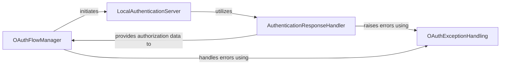

## Component Details

This subsystem manages the Spotify OAuth 2.0 authorization flows, specifically focusing on the Authorization Code and PKCE flows. It involves setting up a local HTTP server to capture the authorization response from Spotify's redirect URI, processing this response to extract necessary tokens, and handling any authentication-related errors. The core purpose is to facilitate a secure and automated token exchange process for user authentication.

### OAuthFlowManager
This component is responsible for managing different Spotify OAuth 2.0 authorization flows, including obtaining authorization URLs, handling redirects, requesting and refreshing access tokens, and managing token caching. It supports both Authorization Code Flow and PKCE Authorization Flow.

**Related Classes/Methods**:

- <a href="https://github.com/spotipy-dev/spotipy/blob/master/spotipy/oauth2.py#L248-L603" target="_blank" rel="noopener noreferrer">`spotipy.spotipy.oauth2.SpotifyOAuth` (248:603)</a>
- <a href="https://github.com/spotipy-dev/spotipy/blob/master/spotipy/oauth2.py#L606-L972" target="_blank" rel="noopener noreferrer">`spotipy.spotipy.oauth2.SpotifyPKCE` (606:972)</a>
- <a href="https://github.com/spotipy-dev/spotipy/blob/master/spotipy/oauth2.py#L423-L435" target="_blank" rel="noopener noreferrer">`spotipy.spotipy.oauth2.SpotifyOAuth:_get_auth_response_local_server` (423:435)</a>
- <a href="https://github.com/spotipy-dev/spotipy/blob/master/spotipy/oauth2.py#L790-L803" target="_blank" rel="noopener noreferrer">`spotipy.spotipy.oauth2.SpotifyPKCE:_get_auth_response_local_server` (790:803)</a>

### LocalAuthenticationServer
This component sets up and manages a local HTTP server to listen for the redirect URI from the Spotify authorization server. It captures the authorization code or error from the redirect URL.

**Related Classes/Methods**:

- <a href="https://github.com/spotipy-dev/spotipy/blob/master/spotipy/oauth2.py#L1283-L1289" target="_blank" rel="noopener noreferrer">`spotipy.spotipy.oauth2.start_local_http_server` (1283:1289)</a>

### AuthenticationResponseHandler
This component acts as the HTTP request handler for the local authentication server. It processes incoming GET requests, parses the authorization response URL to extract the state and authorization code, and handles potential OAuth errors.

**Related Classes/Methods**:

- <a href="https://github.com/spotipy-dev/spotipy/blob/master/spotipy/oauth2.py#L1238-L1280" target="_blank" rel="noopener noreferrer">`spotipy.spotipy.oauth2.RequestHandler` (1238:1280)</a>
- <a href="https://github.com/spotipy-dev/spotipy/blob/master/spotipy/oauth2.py#L1239-L1274" target="_blank" rel="noopener noreferrer">`spotipy.spotipy.oauth2.RequestHandler:do_GET` (1239:1274)</a>

### OAuthExceptionHandling
This component provides custom exception classes specifically for handling errors that occur during the Spotify OAuth process, such as state mismatches or general authentication failures.

**Related Classes/Methods**:

- <a href="https://github.com/spotipy-dev/spotipy/blob/master/spotipy/exceptions.py#L34-L44" target="_blank" rel="noopener noreferrer">`spotipy.exceptions.SpotifyStateError` (34:44)</a>
- <a href="https://github.com/spotipy-dev/spotipy/blob/master/spotipy/exceptions.py#L24-L31" target="_blank" rel="noopener noreferrer">`spotipy.exceptions.SpotifyOauthError` (24:31)</a>

### [FAQ](https://github.com/CodeBoarding/GeneratedOnBoardings/tree/main?tab=readme-ov-file#faq)