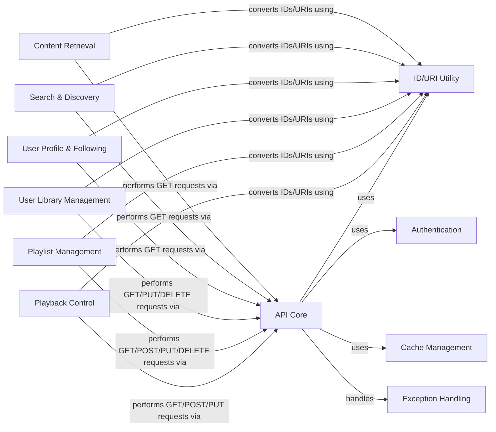

## Component Details

The Spotify API Client subsystem is designed to provide a comprehensive interface for interacting with the Spotify Web API. Its core purpose is to abstract the complexities of HTTP communication, authentication, and data parsing, allowing developers to easily access and manage Spotify content, user profiles, and playback. The main flow involves initiating API requests through the `API Core` component, which handles the underlying HTTP communication, authentication via the `Authentication` component, and error handling through the `Exception Handling` component. Data retrieval and manipulation are then performed by specialized components like `Content Retrieval`, `Search & Discovery`, `User Profile & Following`, `User Library Management`, and `Playlist Management`, all of which rely on the `API Core` for communication and the `ID/URI Utility` for consistent data formatting. `Playback Control` manages user playback, also leveraging the `API Core`. The `Cache Management` component is used by the `Authentication` component to store and retrieve tokens, optimizing performance and reducing redundant requests.

### API Core
Manages the underlying HTTP communication with the Spotify API, including session management, authentication, and error handling for all API requests.

**Related Classes/Methods**:

- <a href="https://github.com/spotipy-dev/spotipy/blob/master/spotipy/client.py#L125-L194" target="_blank" rel="noopener noreferrer">`spotipy.spotipy.client.Spotify:__init__` (125:194)</a>
- <a href="https://github.com/spotipy-dev/spotipy/blob/master/spotipy/client.py#L217-L230" target="_blank" rel="noopener noreferrer">`spotipy.spotipy.client.Spotify:_build_session` (217:230)</a>
- <a href="https://github.com/spotipy-dev/spotipy/blob/master/spotipy/client.py#L232-L241" target="_blank" rel="noopener noreferrer">`spotipy.spotipy.client.Spotify:_auth_headers` (232:241)</a>
- <a href="https://github.com/spotipy-dev/spotipy/blob/master/spotipy/client.py#L243-L315" target="_blank" rel="noopener noreferrer">`spotipy.spotipy.client.Spotify:_internal_call` (243:315)</a>
- <a href="https://github.com/spotipy-dev/spotipy/blob/master/spotipy/client.py#L317-L321" target="_blank" rel="noopener noreferrer">`spotipy.spotipy.client.Spotify:_get` (317:321)</a>
- <a href="https://github.com/spotipy-dev/spotipy/blob/master/spotipy/client.py#L323-L326" target="_blank" rel="noopener noreferrer">`spotipy.spotipy.client.Spotify:_post` (323:326)</a>
- <a href="https://github.com/spotipy-dev/spotipy/blob/master/spotipy/client.py#L328-L331" target="_blank" rel="noopener noreferrer">`spotipy.spotipy.client.Spotify:_delete` (328:331)</a>
- <a href="https://github.com/spotipy-dev/spotipy/blob/master/spotipy/client.py#L333-L336" target="_blank" rel="noopener noreferrer">`spotipy.spotipy.client.Spotify:_put` (333:336)</a>

### ID/URI Utility
Provides helper functions to parse and convert Spotify IDs, URIs, and URLs into a consistent format used for API calls.

**Related Classes/Methods**:

- <a href="https://github.com/spotipy-dev/spotipy/blob/master/spotipy/client.py#L2117-L2139" target="_blank" rel="noopener noreferrer">`spotipy.spotipy.client.Spotify:_get_id` (2117:2139)</a>
- <a href="https://github.com/spotipy-dev/spotipy/blob/master/spotipy/client.py#L2141-L2145" target="_blank" rel="noopener noreferrer">`spotipy.spotipy.client.Spotify:_get_uri` (2141:2145)</a>
- <a href="https://github.com/spotipy-dev/spotipy/blob/master/spotipy/client.py#L2147-L2148" target="_blank" rel="noopener noreferrer">`spotipy.spotipy.client.Spotify:_is_uri` (2147:2148)</a>

### Content Retrieval
Offers methods to retrieve detailed information about various Spotify content types such as tracks, artists, albums, shows, episodes, and audiobooks.

**Related Classes/Methods**:

- <a href="https://github.com/spotipy-dev/spotipy/blob/master/spotipy/client.py#L338-L347" target="_blank" rel="noopener noreferrer">`spotipy.spotipy.client.Spotify:next` (338:347)</a>
- <a href="https://github.com/spotipy-dev/spotipy/blob/master/spotipy/client.py#L349-L358" target="_blank" rel="noopener noreferrer">`spotipy.spotipy.client.Spotify:previous` (349:358)</a>
- <a href="https://github.com/spotipy-dev/spotipy/blob/master/spotipy/client.py#L360-L369" target="_blank" rel="noopener noreferrer">`spotipy.spotipy.client.Spotify:track` (360:369)</a>
- <a href="https://github.com/spotipy-dev/spotipy/blob/master/spotipy/client.py#L371-L380" target="_blank" rel="noopener noreferrer">`spotipy.spotipy.client.Spotify:tracks` (371:380)</a>
- <a href="https://github.com/spotipy-dev/spotipy/blob/master/spotipy/client.py#L382-L390" target="_blank" rel="noopener noreferrer">`spotipy.spotipy.client.Spotify:artist` (382:390)</a>
- <a href="https://github.com/spotipy-dev/spotipy/blob/master/spotipy/client.py#L392-L400" target="_blank" rel="noopener noreferrer">`spotipy.spotipy.client.Spotify:artists` (392:400)</a>
- <a href="https://github.com/spotipy-dev/spotipy/blob/master/spotipy/client.py#L402-L437" target="_blank" rel="noopener noreferrer">`spotipy.spotipy.client.Spotify:artist_albums` (402:437)</a>
- <a href="https://github.com/spotipy-dev/spotipy/blob/master/spotipy/client.py#L439-L449" target="_blank" rel="noopener noreferrer">`spotipy.spotipy.client.Spotify:artist_top_tracks` (439:449)</a>
- <a href="https://github.com/spotipy-dev/spotipy/blob/master/spotipy/client.py#L451-L468" target="_blank" rel="noopener noreferrer">`spotipy.spotipy.client.Spotify:artist_related_artists` (451:468)</a>
- <a href="https://github.com/spotipy-dev/spotipy/blob/master/spotipy/client.py#L470-L482" target="_blank" rel="noopener noreferrer">`spotipy.spotipy.client.Spotify:album` (470:482)</a>
- <a href="https://github.com/spotipy-dev/spotipy/blob/master/spotipy/client.py#L484-L498" target="_blank" rel="noopener noreferrer">`spotipy.spotipy.client.Spotify:album_tracks` (484:498)</a>
- <a href="https://github.com/spotipy-dev/spotipy/blob/master/spotipy/client.py#L500-L512" target="_blank" rel="noopener noreferrer">`spotipy.spotipy.client.Spotify:albums` (500:512)</a>
- <a href="https://github.com/spotipy-dev/spotipy/blob/master/spotipy/client.py#L514-L527" target="_blank" rel="noopener noreferrer">`spotipy.spotipy.client.Spotify:show` (514:527)</a>
- <a href="https://github.com/spotipy-dev/spotipy/blob/master/spotipy/client.py#L529-L542" target="_blank" rel="noopener noreferrer">`spotipy.spotipy.client.Spotify:shows` (529:542)</a>
- <a href="https://github.com/spotipy-dev/spotipy/blob/master/spotipy/client.py#L544-L561" target="_blank" rel="noopener noreferrer">`spotipy.spotipy.client.Spotify:show_episodes` (544:561)</a>
- <a href="https://github.com/spotipy-dev/spotipy/blob/master/spotipy/client.py#L563-L576" target="_blank" rel="noopener noreferrer">`spotipy.spotipy.client.Spotify:episode` (563:576)</a>
- <a href="https://github.com/spotipy-dev/spotipy/blob/master/spotipy/client.py#L578-L591" target="_blank" rel="noopener noreferrer">`spotipy.spotipy.client.Spotify:episodes` (578:591)</a>
- <a href="https://github.com/spotipy-dev/spotipy/blob/master/spotipy/client.py#L2184-L2198" target="_blank" rel="noopener noreferrer">`spotipy.spotipy.client.Spotify:get_audiobook` (2184:2198)</a>
- <a href="https://github.com/spotipy-dev/spotipy/blob/master/spotipy/client.py#L2200-L2213" target="_blank" rel="noopener noreferrer">`spotipy.spotipy.client.Spotify:get_audiobooks` (2200:2213)</a>
- <a href="https://github.com/spotipy-dev/spotipy/blob/master/spotipy/client.py#L2215-L2230" target="_blank" rel="noopener noreferrer">`spotipy.spotipy.client.Spotify:get_audiobook_chapters` (2215:2230)</a>

### Search & Discovery
Enables searching for content across Spotify's catalog and discovering new releases, featured playlists, and categories. It also includes functionality for generating recommendations.

**Related Classes/Methods**:

- <a href="https://github.com/spotipy-dev/spotipy/blob/master/spotipy/client.py#L593-L610" target="_blank" rel="noopener noreferrer">`spotipy.spotipy.client.Spotify:search` (593:610)</a>
- <a href="https://github.com/spotipy-dev/spotipy/blob/master/spotipy/client.py#L612-L642" target="_blank" rel="noopener noreferrer">`spotipy.spotipy.client.Spotify:search_markets` (612:642)</a>
- <a href="https://github.com/spotipy-dev/spotipy/blob/master/spotipy/client.py#L2150-L2182" target="_blank" rel="noopener noreferrer">`spotipy.spotipy.client.Spotify:_search_multiple_markets` (2150:2182)</a>
- <a href="https://github.com/spotipy-dev/spotipy/blob/master/spotipy/client.py#L1630-L1669" target="_blank" rel="noopener noreferrer">`spotipy.spotipy.client.Spotify:featured_playlists` (1630:1669)</a>
- <a href="https://github.com/spotipy-dev/spotipy/blob/master/spotipy/client.py#L1671-L1686" target="_blank" rel="noopener noreferrer">`spotipy.spotipy.client.Spotify:new_releases` (1671:1686)</a>
- <a href="https://github.com/spotipy-dev/spotipy/blob/master/spotipy/client.py#L1688-L1703" target="_blank" rel="noopener noreferrer">`spotipy.spotipy.client.Spotify:category` (1688:1703)</a>
- <a href="https://github.com/spotipy-dev/spotipy/blob/master/spotipy/client.py#L1705-L1727" target="_blank" rel="noopener noreferrer">`spotipy.spotipy.client.Spotify:categories` (1705:1727)</a>
- <a href="https://github.com/spotipy-dev/spotipy/blob/master/spotipy/client.py#L1729-L1759" target="_blank" rel="noopener noreferrer">`spotipy.spotipy.client.Spotify:category_playlists` (1729:1759)</a>
- <a href="https://github.com/spotipy-dev/spotipy/blob/master/spotipy/client.py#L1761-L1834" target="_blank" rel="noopener noreferrer">`spotipy.spotipy.client.Spotify:recommendations` (1761:1834)</a>
- <a href="https://github.com/spotipy-dev/spotipy/blob/master/spotipy/client.py#L1836-L1847" target="_blank" rel="noopener noreferrer">`spotipy.spotipy.client.Spotify:recommendation_genre_seeds` (1836:1847)</a>
- <a href="https://github.com/spotipy-dev/spotipy/blob/master/spotipy/client.py#L1849-L1864" target="_blank" rel="noopener noreferrer">`spotipy.spotipy.client.Spotify:audio_analysis` (1849:1864)</a>
- <a href="https://github.com/spotipy-dev/spotipy/blob/master/spotipy/client.py#L1866-L1892" target="_blank" rel="noopener noreferrer">`spotipy.spotipy.client.Spotify:audio_features` (1866:1892)</a>
- <a href="https://github.com/spotipy-dev/spotipy/blob/master/spotipy/client.py#L2097-L2102" target="_blank" rel="noopener noreferrer">`spotipy.spotipy.client.Spotify:available_markets` (2097:2102)</a>

### User Profile & Following
Manages operations related to fetching user profiles, and managing the current user's followed artists and users, and top items.

**Related Classes/Methods**:

- <a href="https://github.com/spotipy-dev/spotipy/blob/master/spotipy/client.py#L644-L650" target="_blank" rel="noopener noreferrer">`spotipy.spotipy.client.Spotify:user` (644:650)</a>
- <a href="https://github.com/spotipy-dev/spotipy/blob/master/spotipy/client.py#L1304-L1308" target="_blank" rel="noopener noreferrer">`spotipy.spotipy.client.Spotify:me` (1304:1308)</a>
- <a href="https://github.com/spotipy-dev/spotipy/blob/master/spotipy/client.py#L1310-L1314" target="_blank" rel="noopener noreferrer">`spotipy.spotipy.client.Spotify:current_user` (1310:1314)</a>
- <a href="https://github.com/spotipy-dev/spotipy/blob/master/spotipy/client.py#L1510-L1521" target="_blank" rel="noopener noreferrer">`spotipy.spotipy.client.Spotify:current_user_followed_artists` (1510:1521)</a>
- <a href="https://github.com/spotipy-dev/spotipy/blob/master/spotipy/client.py#L1523-L1536" target="_blank" rel="noopener noreferrer">`spotipy.spotipy.client.Spotify:current_user_following_artists` (1523:1536)</a>
- <a href="https://github.com/spotipy-dev/spotipy/blob/master/spotipy/client.py#L1538-L1551" target="_blank" rel="noopener noreferrer">`spotipy.spotipy.client.Spotify:current_user_following_users` (1538:1551)</a>
- <a href="https://github.com/spotipy-dev/spotipy/blob/master/spotipy/client.py#L1553-L1566" target="_blank" rel="noopener noreferrer">`spotipy.spotipy.client.Spotify:current_user_top_artists` (1553:1566)</a>
- <a href="https://github.com/spotipy-dev/spotipy/blob/master/spotipy/client.py#L1568-L1581" target="_blank" rel="noopener noreferrer">`spotipy.spotipy.client.Spotify:current_user_top_tracks` (1568:1581)</a>
- <a href="https://github.com/spotipy-dev/spotipy/blob/master/spotipy/client.py#L1583-L1600" target="_blank" rel="noopener noreferrer">`spotipy.spotipy.client.Spotify:current_user_recently_played` (1583:1600)</a>
- <a href="https://github.com/spotipy-dev/spotipy/blob/master/spotipy/client.py#L1602-L1607" target="_blank" rel="noopener noreferrer">`spotipy.spotipy.client.Spotify:user_follow_artists` (1602:1607)</a>
- <a href="https://github.com/spotipy-dev/spotipy/blob/master/spotipy/client.py#L1609-L1614" target="_blank" rel="noopener noreferrer">`spotipy.spotipy.client.Spotify:user_follow_users` (1609:1614)</a>
- <a href="https://github.com/spotipy-dev/spotipy/blob/master/spotipy/client.py#L1616-L1621" target="_blank" rel="noopener noreferrer">`spotipy.spotipy.client.Spotify:user_unfollow_artists` (1616:1621)</a>
- <a href="https://github.com/spotipy-dev/spotipy/blob/master/spotipy/client.py#L1623-L1628" target="_blank" rel="noopener noreferrer">`spotipy.spotipy.client.Spotify:user_unfollow_users` (1623:1628)</a>

### User Library Management
Provides functionalities for managing the current user's saved content, including albums, tracks, episodes, and shows.

**Related Classes/Methods**:

- <a href="https://github.com/spotipy-dev/spotipy/blob/master/spotipy/client.py#L1331-L1341" target="_blank" rel="noopener noreferrer">`spotipy.spotipy.client.Spotify:current_user_saved_albums` (1331:1341)</a>
- <a href="https://github.com/spotipy-dev/spotipy/blob/master/spotipy/client.py#L1343-L1351" target="_blank" rel="noopener noreferrer">`spotipy.spotipy.client.Spotify:current_user_saved_albums_add` (1343:1351)</a>
- <a href="https://github.com/spotipy-dev/spotipy/blob/master/spotipy/client.py#L1353-L1361" target="_blank" rel="noopener noreferrer">`spotipy.spotipy.client.Spotify:current_user_saved_albums_delete` (1353:1361)</a>
- <a href="https://github.com/spotipy-dev/spotipy/blob/master/spotipy/client.py#L1363-L1371" target="_blank" rel="noopener noreferrer">`spotipy.spotipy.client.Spotify:current_user_saved_albums_contains` (1363:1371)</a>
- <a href="https://github.com/spotipy-dev/spotipy/blob/master/spotipy/client.py#L1373-L1383" target="_blank" rel="noopener noreferrer">`spotipy.spotipy.client.Spotify:current_user_saved_tracks` (1373:1383)</a>
- <a href="https://github.com/spotipy-dev/spotipy/blob/master/spotipy/client.py#L1385-L1395" target="_blank" rel="noopener noreferrer">`spotipy.spotipy.client.Spotify:current_user_saved_tracks_add` (1385:1395)</a>
- <a href="https://github.com/spotipy-dev/spotipy/blob/master/spotipy/client.py#L1397-L1407" target="_blank" rel="noopener noreferrer">`spotipy.spotipy.client.Spotify:current_user_saved_tracks_delete` (1397:1407)</a>
- <a href="https://github.com/spotipy-dev/spotipy/blob/master/spotipy/client.py#L1409-L1419" target="_blank" rel="noopener noreferrer">`spotipy.spotipy.client.Spotify:current_user_saved_tracks_contains` (1409:1419)</a>
- <a href="https://github.com/spotipy-dev/spotipy/blob/master/spotipy/client.py#L1421-L1431" target="_blank" rel="noopener noreferrer">`spotipy.spotipy.client.Spotify:current_user_saved_episodes` (1421:1431)</a>
- <a href="https://github.com/spotipy-dev/spotipy/blob/master/spotipy/client.py#L1433-L1443" target="_blank" rel="noopener noreferrer">`spotipy.spotipy.client.Spotify:current_user_saved_episodes_add` (1433:1443)</a>
- <a href="https://github.com/spotipy-dev/spotipy/blob/master/spotipy/client.py#L1445-L1455" target="_blank" rel="noopener noreferrer">`spotipy.spotipy.client.Spotify:current_user_saved_episodes_delete` (1445:1455)</a>
- <a href="https://github.com/spotipy-dev/spotipy/blob/master/spotipy/client.py#L1457-L1467" target="_blank" rel="noopener noreferrer">`spotipy.spotipy.client.Spotify:current_user_saved_episodes_contains` (1457:1467)</a>
- <a href="https://github.com/spotipy-dev/spotipy/blob/master/spotipy/client.py#L1469-L1479" target="_blank" rel="noopener noreferrer">`spotipy.spotipy.client.Spotify:current_user_saved_shows` (1469:1479)</a>
- <a href="https://github.com/spotipy-dev/spotipy/blob/master/spotipy/client.py#L1481-L1488" target="_blank" rel="noopener noreferrer">`spotipy.spotipy.client.Spotify:current_user_saved_shows_add` (1481:1488)</a>
- <a href="https://github.com/spotipy-dev/spotipy/blob/master/spotipy/client.py#L1490-L1498" target="_blank" rel="noopener noreferrer">`spotipy.spotipy.client.Spotify:current_user_saved_shows_delete` (1490:1498)</a>
- <a href="https://github.com/spotipy-dev/spotipy/blob/master/spotipy/client.py#L1500-L1508" target="_blank" rel="noopener noreferrer">`spotipy.spotipy.client.Spotify:current_user_saved_shows_contains` (1500:1508)</a>

### Playlist Management
Handles all operations related to Spotify playlists, including retrieving playlist details, managing playlist items (tracks/episodes), changing playlist details, and managing playlist followers.

**Related Classes/Methods**:

- <a href="https://github.com/spotipy-dev/spotipy/blob/master/spotipy/client.py#L652-L658" target="_blank" rel="noopener noreferrer">`spotipy.spotipy.client.Spotify:current_user_playlists` (652:658)</a>
- <a href="https://github.com/spotipy-dev/spotipy/blob/master/spotipy/client.py#L660-L677" target="_blank" rel="noopener noreferrer">`spotipy.spotipy.client.Spotify:playlist` (660:677)</a>
- <a href="https://github.com/spotipy-dev/spotipy/blob/master/spotipy/client.py#L679-L709" target="_blank" rel="noopener noreferrer">`spotipy.spotipy.client.Spotify:playlist_tracks` (679:709)</a>
- <a href="https://github.com/spotipy-dev/spotipy/blob/master/spotipy/client.py#L711-L739" target="_blank" rel="noopener noreferrer">`spotipy.spotipy.client.Spotify:playlist_items` (711:739)</a>
- <a href="https://github.com/spotipy-dev/spotipy/blob/master/spotipy/client.py#L741-L748" target="_blank" rel="noopener noreferrer">`spotipy.spotipy.client.Spotify:playlist_cover_image` (741:748)</a>
- <a href="https://github.com/spotipy-dev/spotipy/blob/master/spotipy/client.py#L750-L763" target="_blank" rel="noopener noreferrer">`spotipy.spotipy.client.Spotify:playlist_upload_cover_image` (750:763)</a>
- <a href="https://github.com/spotipy-dev/spotipy/blob/master/spotipy/client.py#L765-L784" target="_blank" rel="noopener noreferrer">`spotipy.spotipy.client.Spotify:user_playlist` (765:784)</a>
- <a href="https://github.com/spotipy-dev/spotipy/blob/master/spotipy/client.py#L786-L819" target="_blank" rel="noopener noreferrer">`spotipy.spotipy.client.Spotify:user_playlist_tracks` (786:819)</a>
- <a href="https://github.com/spotipy-dev/spotipy/blob/master/spotipy/client.py#L821-L831" target="_blank" rel="noopener noreferrer">`spotipy.spotipy.client.Spotify:user_playlists` (821:831)</a>
- <a href="https://github.com/spotipy-dev/spotipy/blob/master/spotipy/client.py#L833-L850" target="_blank" rel="noopener noreferrer">`spotipy.spotipy.client.Spotify:user_playlist_create` (833:850)</a>
- <a href="https://github.com/spotipy-dev/spotipy/blob/master/spotipy/client.py#L852-L883" target="_blank" rel="noopener noreferrer">`spotipy.spotipy.client.Spotify:user_playlist_change_details` (852:883)</a>
- <a href="https://github.com/spotipy-dev/spotipy/blob/master/spotipy/client.py#L885-L902" target="_blank" rel="noopener noreferrer">`spotipy.spotipy.client.Spotify:user_playlist_unfollow` (885:902)</a>
- <a href="https://github.com/spotipy-dev/spotipy/blob/master/spotipy/client.py#L904-L927" target="_blank" rel="noopener noreferrer">`spotipy.spotipy.client.Spotify:user_playlist_add_tracks` (904:927)</a>
- <a href="https://github.com/spotipy-dev/spotipy/blob/master/spotipy/client.py#L929-L952" target="_blank" rel="noopener noreferrer">`spotipy.spotipy.client.Spotify:user_playlist_add_episodes` (929:952)</a>
- <a href="https://github.com/spotipy-dev/spotipy/blob/master/spotipy/client.py#L954-L972" target="_blank" rel="noopener noreferrer">`spotipy.spotipy.client.Spotify:user_playlist_replace_tracks` (954:972)</a>
- <a href="https://github.com/spotipy-dev/spotipy/blob/master/spotipy/client.py#L974-L1007" target="_blank" rel="noopener noreferrer">`spotipy.spotipy.client.Spotify:user_playlist_reorder_tracks` (974:1007)</a>
- <a href="https://github.com/spotipy-dev/spotipy/blob/master/spotipy/client.py#L1009-L1033" target="_blank" rel="noopener noreferrer">`spotipy.spotipy.client.Spotify:user_playlist_remove_all_occurrences_of_tracks` (1009:1033)</a>
- <a href="https://github.com/spotipy-dev/spotipy/blob/master/spotipy/client.py#L1035-L1074" target="_blank" rel="noopener noreferrer">`spotipy.spotipy.client.Spotify:user_playlist_remove_specific_occurrences_of_tracks` (1035:1074)</a>
- <a href="https://github.com/spotipy-dev/spotipy/blob/master/spotipy/client.py#L1076-L1093" target="_blank" rel="noopener noreferrer">`spotipy.spotipy.client.Spotify:user_playlist_follow_playlist` (1076:1093)</a>
- <a href="https://github.com/spotipy-dev/spotipy/blob/master/spotipy/client.py#L1095-L1116" target="_blank" rel="noopener noreferrer">`spotipy.spotipy.client.Spotify:user_playlist_is_following` (1095:1116)</a>
- <a href="https://github.com/spotipy-dev/spotipy/blob/master/spotipy/client.py#L1118-L1148" target="_blank" rel="noopener noreferrer">`spotipy.spotipy.client.Spotify:playlist_change_details` (1118:1148)</a>
- <a href="https://github.com/spotipy-dev/spotipy/blob/master/spotipy/client.py#L1150-L1159" target="_blank" rel="noopener noreferrer">`spotipy.spotipy.client.Spotify:current_user_unfollow_playlist` (1150:1159)</a>
- <a href="https://github.com/spotipy-dev/spotipy/blob/master/spotipy/client.py#L1161-L1177" target="_blank" rel="noopener noreferrer">`spotipy.spotipy.client.Spotify:playlist_add_items` (1161:1177)</a>
- <a href="https://github.com/spotipy-dev/spotipy/blob/master/spotipy/client.py#L1179-L1191" target="_blank" rel="noopener noreferrer">`spotipy.spotipy.client.Spotify:playlist_replace_items` (1179:1191)</a>
- <a href="https://github.com/spotipy-dev/spotipy/blob/master/spotipy/client.py#L1193-L1222" target="_blank" rel="noopener noreferrer">`spotipy.spotipy.client.Spotify:playlist_reorder_items` (1193:1222)</a>
- <a href="https://github.com/spotipy-dev/spotipy/blob/master/spotipy/client.py#L1224-L1243" target="_blank" rel="noopener noreferrer">`spotipy.spotipy.client.Spotify:playlist_remove_all_occurrences_of_items` (1224:1243)</a>
- <a href="https://github.com/spotipy-dev/spotipy/blob/master/spotipy/client.py#L1245-L1274" target="_blank" rel="noopener noreferrer">`spotipy.spotipy.client.Spotify:playlist_remove_specific_occurrences_of_items` (1245:1274)</a>
- <a href="https://github.com/spotipy-dev/spotipy/blob/master/spotipy/client.py#L1276-L1287" target="_blank" rel="noopener noreferrer">`spotipy.spotipy.client.Spotify:current_user_follow_playlist` (1276:1287)</a>
- <a href="https://github.com/spotipy-dev/spotipy/blob/master/spotipy/client.py#L1289-L1302" target="_blank" rel="noopener noreferrer">`spotipy.spotipy.client.Spotify:playlist_is_following` (1289:1302)</a>

### Playback Control
Provides methods to control the user's Spotify playback, including getting device information, managing current playback state, and controlling track actions (play, pause, skip, seek, volume, shuffle, repeat, queue).

**Related Classes/Methods**:

- <a href="https://github.com/spotipy-dev/spotipy/blob/master/spotipy/client.py#L1894-L1897" target="_blank" rel="noopener noreferrer">`spotipy.spotipy.client.Spotify:devices` (1894:1897)</a>
- <a href="https://github.com/spotipy-dev/spotipy/blob/master/spotipy/client.py#L1899-L1906" target="_blank" rel="noopener noreferrer">`spotipy.spotipy.client.Spotify:current_playback` (1899:1906)</a>
- <a href="https://github.com/spotipy-dev/spotipy/blob/master/spotipy/client.py#L1908-L1916" target="_blank" rel="noopener noreferrer">`spotipy.spotipy.client.Spotify:currently_playing` (1908:1916)</a>
- <a href="https://github.com/spotipy-dev/spotipy/blob/master/spotipy/client.py#L1918-L1929" target="_blank" rel="noopener noreferrer">`spotipy.spotipy.client.Spotify:transfer_playback` (1918:1929)</a>
- <a href="https://github.com/spotipy-dev/spotipy/blob/master/spotipy/client.py#L1931-L1972" target="_blank" rel="noopener noreferrer">`spotipy.spotipy.client.Spotify:start_playback` (1931:1972)</a>
- <a href="https://github.com/spotipy-dev/spotipy/blob/master/spotipy/client.py#L1974-L1980" target="_blank" rel="noopener noreferrer">`spotipy.spotipy.client.Spotify:pause_playback` (1974:1980)</a>
- <a href="https://github.com/spotipy-dev/spotipy/blob/master/spotipy/client.py#L1982-L1988" target="_blank" rel="noopener noreferrer">`spotipy.spotipy.client.Spotify:next_track` (1982:1988)</a>
- <a href="https://github.com/spotipy-dev/spotipy/blob/master/spotipy/client.py#L1990-L1998" target="_blank" rel="noopener noreferrer">`spotipy.spotipy.client.Spotify:previous_track` (1990:1998)</a>
- <a href="https://github.com/spotipy-dev/spotipy/blob/master/spotipy/client.py#L2000-L2014" target="_blank" rel="noopener noreferrer">`spotipy.spotipy.client.Spotify:seek_track` (2000:2014)</a>
- <a href="https://github.com/spotipy-dev/spotipy/blob/master/spotipy/client.py#L2016-L2030" target="_blank" rel="noopener noreferrer">`spotipy.spotipy.client.Spotify:repeat` (2016:2030)</a>
- <a href="https://github.com/spotipy-dev/spotipy/blob/master/spotipy/client.py#L2032-L2050" target="_blank" rel="noopener noreferrer">`spotipy.spotipy.client.Spotify:volume` (2032:2050)</a>
- <a href="https://github.com/spotipy-dev/spotipy/blob/master/spotipy/client.py#L2052-L2067" target="_blank" rel="noopener noreferrer">`spotipy.spotipy.client.Spotify:shuffle` (2052:2067)</a>
- <a href="https://github.com/spotipy-dev/spotipy/blob/master/spotipy/client.py#L2069-L2071" target="_blank" rel="noopener noreferrer">`spotipy.spotipy.client.Spotify:queue` (2069:2071)</a>
- <a href="https://github.com/spotipy-dev/spotipy/blob/master/spotipy/client.py#L2073-L2095" target="_blank" rel="noopener noreferrer">`spotipy.spotipy.client.Spotify:add_to_queue` (2073:2095)</a>
- <a href="https://github.com/spotipy-dev/spotipy/blob/master/spotipy/client.py#L2104-L2115" target="_blank" rel="noopener noreferrer">`spotipy.spotipy.client.Spotify:_append_device_id` (2104:2115)</a>

### Authentication
Handles the various Spotify authentication flows (e.g., Client Credentials, Authorization Code, Implicit Grant, PKCE) and token management.

**Related Classes/Methods**:

- <a href="https://github.com/spotipy-dev/spotipy/blob/master/spotipy/oauth2.py#L46-L127" target="_blank" rel="noopener noreferrer">`spotipy.oauth2.SpotifyAuthBase` (46:127)</a>
- <a href="https://github.com/spotipy-dev/spotipy/blob/master/spotipy/oauth2.py#L130-L245" target="_blank" rel="noopener noreferrer">`spotipy.oauth2.SpotifyClientCredentials` (130:245)</a>
- <a href="https://github.com/spotipy-dev/spotipy/blob/master/spotipy/oauth2.py#L975-L1235" target="_blank" rel="noopener noreferrer">`spotipy.oauth2.SpotifyImplicitGrant` (975:1235)</a>
- <a href="https://github.com/spotipy-dev/spotipy/blob/master/spotipy/oauth2.py#L248-L603" target="_blank" rel="noopener noreferrer">`spotipy.oauth2.SpotifyOAuth` (248:603)</a>
- <a href="https://github.com/spotipy-dev/spotipy/blob/master/spotipy/oauth2.py#L606-L972" target="_blank" rel="noopener noreferrer">`spotipy.oauth2.SpotifyPKCE` (606:972)</a>

### Cache Management
Provides mechanisms for caching Spotify API responses or authentication tokens to reduce redundant requests and improve performance.

**Related Classes/Methods**:

- <a href="https://github.com/spotipy-dev/spotipy/blob/master/spotipy/cache_handler.py#L22-L43" target="_blank" rel="noopener noreferrer">`spotipy.cache_handler.CacheHandler` (22:43)</a>
- <a href="https://github.com/spotipy-dev/spotipy/blob/master/spotipy/cache_handler.py#L46-L102" target="_blank" rel="noopener noreferrer">`spotipy.cache_handler.CacheFileHandler` (46:102)</a>
- <a href="https://github.com/spotipy-dev/spotipy/blob/master/spotipy/cache_handler.py#L126-L155" target="_blank" rel="noopener noreferrer">`spotipy.cache_handler.DjangoSessionCacheHandler` (126:155)</a>
- <a href="https://github.com/spotipy-dev/spotipy/blob/master/spotipy/cache_handler.py#L158-L180" target="_blank" rel="noopener noreferrer">`spotipy.cache_handler.FlaskSessionCacheHandler` (158:180)</a>
- <a href="https://github.com/spotipy-dev/spotipy/blob/master/spotipy/cache_handler.py#L217-L246" target="_blank" rel="noopener noreferrer">`spotipy.cache_handler.MemcacheCacheHandler` (217:246)</a>
- <a href="https://github.com/spotipy-dev/spotipy/blob/master/spotipy/cache_handler.py#L105-L123" target="_blank" rel="noopener noreferrer">`spotipy.cache_handler.MemoryCacheHandler` (105:123)</a>
- <a href="https://github.com/spotipy-dev/spotipy/blob/master/spotipy/cache_handler.py#L183-L214" target="_blank" rel="noopener noreferrer">`spotipy.cache_handler.RedisCacheHandler` (183:214)</a>

### Exception Handling
Defines custom exception classes for Spotify API errors and authentication failures.

**Related Classes/Methods**:

- <a href="https://github.com/spotipy-dev/spotipy/blob/master/spotipy/exceptions.py#L1-L2" target="_blank" rel="noopener noreferrer">`spotipy.exceptions.SpotifyBaseException` (1:2)</a>
- <a href="https://github.com/spotipy-dev/spotipy/blob/master/spotipy/exceptions.py#L5-L21" target="_blank" rel="noopener noreferrer">`spotipy.exceptions.SpotifyException` (5:21)</a>
- <a href="https://github.com/spotipy-dev/spotipy/blob/master/spotipy/exceptions.py#L24-L31" target="_blank" rel="noopener noreferrer">`spotipy.exceptions.SpotifyOauthError` (24:31)</a>
- <a href="https://github.com/spotipy-dev/spotipy/blob/master/spotipy/exceptions.py#L34-L44" target="_blank" rel="noopener noreferrer">`spotipy.exceptions.SpotifyStateError` (34:44)</a>

### [FAQ](https://github.com/CodeBoarding/GeneratedOnBoardings/tree/main?tab=readme-ov-file#faq)