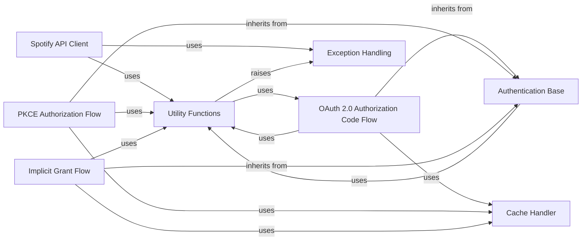

## Component Details

This graph illustrates the core components of the Spotipy library, focusing on the Spotify API Client, various authentication flows, and supporting utilities. The Spotify API Client is central, interacting with exception handling and general utility functions. The different OAuth 2.0 flows (Authorization Code, PKCE, and Implicit Grant) all inherit from a common Authentication Base, which in turn utilizes utility functions. These authentication flows also rely on a Cache Handler for token persistence and the general Utility Functions for common tasks. Notably, the Utility Functions component can also initiate the OAuth 2.0 Authorization Code Flow and raise exceptions.

### Utility Functions
This component provides a collection of general-purpose utility functions that support various parts of the Spotipy library. These include functions for normalizing Spotify API scopes, retrieving host and port information for local servers, and handling retry mechanisms for network requests. It also contains a function to prompt the user for an authentication token.

**Related Classes/Methods**:

- <a href="https://github.com/spotipy-dev/spotipy/blob/master/spotipy/util.py#L160-L185" target="_blank" rel="noopener noreferrer">`spotipy.util.Retry` (160:185)</a>
- <a href="https://github.com/spotipy-dev/spotipy/blob/master/spotipy/util.py#L136-L157" target="_blank" rel="noopener noreferrer">`spotipy.util.normalize_scope` (136:157)</a>
- <a href="https://github.com/spotipy-dev/spotipy/blob/master/spotipy/util.py#L119-L133" target="_blank" rel="noopener noreferrer">`spotipy.util.get_host_port` (119:133)</a>
- <a href="https://github.com/spotipy-dev/spotipy/blob/master/spotipy/util.py#L30-L116" target="_blank" rel="noopener noreferrer">`spotipy.util.prompt_for_user_token` (30:116)</a>

### Spotify API Client
This component is responsible for handling all interactions with the Spotify Web API. It manages HTTP sessions, applies retry logic for transient errors, constructs authenticated requests, and processes API responses, including error handling.

**Related Classes/Methods**:

- <a href="https://github.com/spotipy-dev/spotipy/blob/master/spotipy/client.py#L19-L2230" target="_blank" rel="noopener noreferrer">`spotipy.spotipy.client.Spotify` (19:2230)</a>
- <a href="https://github.com/spotipy-dev/spotipy/blob/master/spotipy/client.py#L217-L230" target="_blank" rel="noopener noreferrer">`spotipy.spotipy.client.Spotify:_build_session` (217:230)</a>
- <a href="https://github.com/spotipy-dev/spotipy/blob/master/spotipy/client.py#L243-L315" target="_blank" rel="noopener noreferrer">`spotipy.spotipy.client.Spotify._internal_call` (243:315)</a>
- <a href="https://github.com/spotipy-dev/spotipy/blob/master/spotipy/client.py#L232-L241" target="_blank" rel="noopener noreferrer">`spotipy.spotipy.client.Spotify._auth_headers` (232:241)</a>

### Authentication Base
This component provides the foundational functionalities for different Spotify authentication flows. It includes methods for normalizing authentication scopes and serves as a base class for specific OAuth implementations, ensuring common setup and utility for managing access to the Spotify API.

**Related Classes/Methods**:

- <a href="https://github.com/spotipy-dev/spotipy/blob/master/spotipy/oauth2.py#L46-L127" target="_blank" rel="noopener noreferrer">`spotipy.spotipy.oauth2.SpotifyAuthBase` (46:127)</a>
- <a href="https://github.com/spotipy-dev/spotipy/blob/master/spotipy/oauth2.py#L47-L55" target="_blank" rel="noopener noreferrer">`spotipy.spotipy.oauth2.SpotifyAuthBase:__init__` (47:55)</a>
- <a href="https://github.com/spotipy-dev/spotipy/blob/master/spotipy/oauth2.py#L57-L58" target="_blank" rel="noopener noreferrer">`spotipy.spotipy.oauth2.SpotifyAuthBase:_normalize_scope` (57:58)</a>

### OAuth 2.0 Authorization Code Flow
This component implements the Spotify Authorization Code Flow, handling the process of obtaining user consent and exchanging authorization codes for access tokens. It manages the redirection to Spotify's authorization page, listens for the callback, and retrieves the necessary tokens for authenticated API requests. It also integrates with a cache handler for token persistence.

**Related Classes/Methods**:

- <a href="https://github.com/spotipy-dev/spotipy/blob/master/spotipy/oauth2.py#L248-L603" target="_blank" rel="noopener noreferrer">`spotipy.spotipy.oauth2.SpotifyOAuth` (248:603)</a>
- <a href="https://github.com/spotipy-dev/spotipy/blob/master/spotipy/oauth2.py#L255-L335" target="_blank" rel="noopener noreferrer">`spotipy.spotipy.oauth2.SpotifyOAuth:__init__` (255:335)</a>
- <a href="https://github.com/spotipy-dev/spotipy/blob/master/spotipy/oauth2.py#L437-L476" target="_blank" rel="noopener noreferrer">`spotipy.spotipy.oauth2.SpotifyOAuth:get_auth_response` (437:476)</a>
- <a href="https://github.com/spotipy-dev/spotipy/blob/master/spotipy/oauth2.py#L423-L435" target="_blank" rel="noopener noreferrer">`spotipy.spotipy.oauth2.SpotifyOAuth._get_auth_response_local_server` (423:435)</a>
- <a href="https://github.com/spotipy-dev/spotipy/blob/master/spotipy/oauth2.py#L407-L421" target="_blank" rel="noopener noreferrer">`spotipy.spotipy.oauth2.SpotifyOAuth._get_auth_response_interactive` (407:421)</a>
- <a href="https://github.com/spotipy-dev/spotipy/blob/master/spotipy/oauth2.py#L337-L352" target="_blank" rel="noopener noreferrer">`spotipy.spotipy.oauth2.SpotifyOAuth.validate_token` (337:352)</a>
- <a href="https://github.com/spotipy-dev/spotipy/blob/master/spotipy/oauth2.py#L483-L540" target="_blank" rel="noopener noreferrer">`spotipy.spotipy.oauth2.SpotifyOAuth.get_access_token` (483:540)</a>

### PKCE Authorization Flow
This component handles the Proof Key for Code Exchange (PKCE) authorization flow, which is a secure method for public clients to obtain access tokens without a client secret. It manages the generation of code verifiers and challenges, the authorization request, and the token exchange process, similar to the Authorization Code Flow but with enhanced security for mobile and desktop applications.

**Related Classes/Methods**:

- <a href="https://github.com/spotipy-dev/spotipy/blob/master/spotipy/oauth2.py#L606-L972" target="_blank" rel="noopener noreferrer">`spotipy.spotipy.oauth2.SpotifyPKCE` (606:972)</a>
- <a href="https://github.com/spotipy-dev/spotipy/blob/master/spotipy/oauth2.py#L621-L695" target="_blank" rel="noopener noreferrer">`spotipy.spotipy.oauth2.SpotifyPKCE:__init__` (621:695)</a>
- <a href="https://github.com/spotipy-dev/spotipy/blob/master/spotipy/oauth2.py#L750-L788" target="_blank" rel="noopener noreferrer">`spotipy.spotipy.oauth2.SpotifyPKCE:_get_auth_response` (750:788)</a>
- <a href="https://github.com/spotipy-dev/spotipy/blob/master/spotipy/oauth2.py#L790-L803" target="_blank" rel="noopener noreferrer">`spotipy.spotipy.oauth2.SpotifyPKCE._get_auth_response_local_server` (790:803)</a>
- <a href="https://github.com/spotipy-dev/spotipy/blob/master/spotipy/oauth2.py#L805-L817" target="_blank" rel="noopener noreferrer">`spotipy.spotipy.oauth2.SpotifyPKCE._get_auth_response_interactive` (805:817)</a>

### Implicit Grant Flow
This component implements the Implicit Grant Flow, a simplified authorization method primarily used for client-side applications where the access token is returned directly in the URI fragment. It manages opening the authorization URL and parsing the response to extract the token, suitable for scenarios where a backend server is not feasible.

**Related Classes/Methods**:

- <a href="https://github.com/spotipy-dev/spotipy/blob/master/spotipy/oauth2.py#L975-L1235" target="_blank" rel="noopener noreferrer">`spotipy.spotipy.oauth2.SpotifyImplicitGrant` (975:1235)</a>
- <a href="https://github.com/spotipy-dev/spotipy/blob/master/spotipy/oauth2.py#L1010-L1077" target="_blank" rel="noopener noreferrer">`spotipy.spotipy.oauth2.SpotifyImplicitGrant:__init__` (1010:1077)</a>
- <a href="https://github.com/spotipy-dev/spotipy/blob/master/spotipy/oauth2.py#L1173-L1200" target="_blank" rel="noopener noreferrer">`spotipy.spotipy.oauth2.SpotifyImplicitGrant:get_auth_response` (1173:1200)</a>
- <a href="https://github.com/spotipy-dev/spotipy/blob/master/spotipy/oauth2.py#L1165-L1171" target="_blank" rel="noopener noreferrer">`spotipy.spotipy.oauth2.SpotifyImplicitGrant._open_auth_url` (1165:1171)</a>
- `spotipy.spotipy.oauth2.SpotifyImplicitGrant._get_user_input` (full file reference)
- <a href="https://github.com/spotipy-dev/spotipy/blob/master/spotipy/oauth2.py#L1140-L1148" target="_blank" rel="noopener noreferrer">`spotipy.spotipy.oauth2.SpotifyImplicitGrant.parse_response_token` (1140:1148)</a>

### Cache Handler
This component is responsible for managing the caching of authentication tokens. It provides mechanisms to store and retrieve tokens, typically from a file, to avoid repeated authentication prompts and improve performance. It ensures that tokens are persisted securely and efficiently for subsequent use.

**Related Classes/Methods**:

- <a href="https://github.com/spotipy-dev/spotipy/blob/master/spotipy/cache_handler.py#L46-L102" target="_blank" rel="noopener noreferrer">`spotipy.cache_handler.CacheFileHandler` (46:102)</a>

### Exception Handling
This component defines custom exception classes specific to the Spotipy library. It is used to encapsulate and propagate errors that occur during interactions with the Spotify API, providing more specific context than generic exceptions. This allows for more robust error management and user feedback within applications using Spotipy.

**Related Classes/Methods**:

- <a href="https://github.com/spotipy-dev/spotipy/blob/master/spotipy/exceptions.py#L5-L21" target="_blank" rel="noopener noreferrer">`spotipy.exceptions.SpotifyException` (5:21)</a>

### [FAQ](https://github.com/CodeBoarding/GeneratedOnBoardings/tree/main?tab=readme-ov-file#faq)