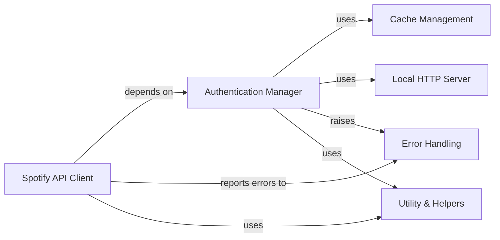

## Component Details

The `spotipy` library provides a Pythonic interface to the Spotify Web API, enabling developers to interact with Spotify's services for music playback, user data, and content management. The core functionality revolves around making authenticated API requests, managing various OAuth 2.0 authentication flows, and handling data persistence for tokens. It also includes robust error handling and utility functions to streamline interactions with the Spotify platform.

### Spotify API Client
The core component responsible for making all requests to the Spotify Web API. It handles various API endpoints for tracks, artists, albums, playlists, users, and playback control, managing the underlying HTTP communication and session, including retries and error handling.

**Related Classes/Methods**:

- <a href="https://github.com/spotipy-dev/spotipy/blob/master/spotipy/client.py#L19-L2230" target="_blank" rel="noopener noreferrer">`spotipy.spotipy.client.Spotify` (19:2230)</a>
- <a href="https://github.com/spotipy-dev/spotipy/blob/master/spotipy/client.py#L125-L194" target="_blank" rel="noopener noreferrer">`spotipy.spotipy.client.Spotify:__init__` (125:194)</a>
- <a href="https://github.com/spotipy-dev/spotipy/blob/master/spotipy/client.py#L217-L230" target="_blank" rel="noopener noreferrer">`spotipy.spotipy.client.Spotify:_build_session` (217:230)</a>
- <a href="https://github.com/spotipy-dev/spotipy/blob/master/spotipy/client.py#L243-L315" target="_blank" rel="noopener noreferrer">`spotipy.spotipy.client.Spotify:_internal_call` (243:315)</a>
- <a href="https://github.com/spotipy-dev/spotipy/blob/master/spotipy/client.py#L317-L321" target="_blank" rel="noopener noreferrer">`spotipy.spotipy.client.Spotify:_get` (317:321)</a>
- <a href="https://github.com/spotipy-dev/spotipy/blob/master/spotipy/client.py#L323-L326" target="_blank" rel="noopener noreferrer">`spotipy.spotipy.client.Spotify:_post` (323:326)</a>
- <a href="https://github.com/spotipy-dev/spotipy/blob/master/spotipy/client.py#L328-L331" target="_blank" rel="noopener noreferrer">`spotipy.spotipy.client.Spotify:_delete` (328:331)</a>
- <a href="https://github.com/spotipy-dev/spotipy/blob/master/spotipy/client.py#L333-L336" target="_blank" rel="noopener noreferrer">`spotipy.spotipy.client.Spotify:_put` (333:336)</a>

### Authentication Manager
Manages all OAuth 2.0 authentication flows (Client Credentials, Authorization Code, PKCE, Implicit Grant) and handles token acquisition, validation, and refreshing. It provides the necessary access tokens for the Spotify API Client.

**Related Classes/Methods**:

- <a href="https://github.com/spotipy-dev/spotipy/blob/master/spotipy/oauth2.py#L46-L127" target="_blank" rel="noopener noreferrer">`spotipy.spotipy.oauth2.SpotifyAuthBase` (46:127)</a>
- <a href="https://github.com/spotipy-dev/spotipy/blob/master/spotipy/oauth2.py#L130-L245" target="_blank" rel="noopener noreferrer">`spotipy.spotipy.oauth2.SpotifyClientCredentials` (130:245)</a>
- <a href="https://github.com/spotipy-dev/spotipy/blob/master/spotipy/oauth2.py#L248-L603" target="_blank" rel="noopener noreferrer">`spotipy.spotipy.oauth2.SpotifyOAuth` (248:603)</a>
- <a href="https://github.com/spotipy-dev/spotipy/blob/master/spotipy/oauth2.py#L606-L972" target="_blank" rel="noopener noreferrer">`spotipy.spotipy.oauth2.SpotifyPKCE` (606:972)</a>
- <a href="https://github.com/spotipy-dev/spotipy/blob/master/spotipy/oauth2.py#L975-L1235" target="_blank" rel="noopener noreferrer">`spotipy.spotipy.oauth2.SpotifyImplicitGrant` (975:1235)</a>

### Error Handling
Defines custom exception classes for various error conditions encountered during API calls or OAuth processes, providing structured error information for robust error management.

**Related Classes/Methods**:

- <a href="https://github.com/spotipy-dev/spotipy/blob/master/spotipy/exceptions.py#L5-L21" target="_blank" rel="noopener noreferrer">`spotipy.exceptions.SpotifyException` (5:21)</a>
- <a href="https://github.com/spotipy-dev/spotipy/blob/master/spotipy/exceptions.py#L24-L31" target="_blank" rel="noopener noreferrer">`spotipy.exceptions.SpotifyOauthError` (24:31)</a>
- <a href="https://github.com/spotipy-dev/spotipy/blob/master/spotipy/exceptions.py#L34-L44" target="_blank" rel="noopener noreferrer">`spotipy.exceptions.SpotifyStateError` (34:44)</a>

### Utility & Helpers
A collection of helper functions used throughout the Spotipy library for tasks such as normalizing scopes, parsing host/port information, and providing a user-friendly token prompting mechanism, as well as handling HTTP request retries.

**Related Classes/Methods**:

- <a href="https://github.com/spotipy-dev/spotipy/blob/master/spotipy/util.py#L160-L185" target="_blank" rel="noopener noreferrer">`spotipy.util.Retry` (160:185)</a>
- <a href="https://github.com/spotipy-dev/spotipy/blob/master/spotipy/util.py#L136-L157" target="_blank" rel="noopener noreferrer">`spotipy.util.normalize_scope` (136:157)</a>
- <a href="https://github.com/spotipy-dev/spotipy/blob/master/spotipy/util.py#L119-L133" target="_blank" rel="noopener noreferrer">`spotipy.util.get_host_port` (119:133)</a>
- <a href="https://github.com/spotipy-dev/spotipy/blob/master/spotipy/util.py#L30-L116" target="_blank" rel="noopener noreferrer">`spotipy.util.prompt_for_user_token` (30:116)</a>

### Cache Management
Provides mechanisms for persisting and retrieving authentication tokens, reducing the need for repeated user authentication. `CacheFileHandler` is a common implementation for file-based caching.

**Related Classes/Methods**:

- <a href="https://github.com/spotipy-dev/spotipy/blob/master/spotipy/cache_handler.py#L46-L102" target="_blank" rel="noopener noreferrer">`spotipy.cache_handler.CacheFileHandler` (46:102)</a>

### Local HTTP Server
A small HTTP server used by specific OAuth flows (like Authorization Code and PKCE) to receive the authorization response from Spotify's redirect URI, facilitating the token exchange process.

**Related Classes/Methods**:

- <a href="https://github.com/spotipy-dev/spotipy/blob/master/spotipy/oauth2.py#L1283-L1289" target="_blank" rel="noopener noreferrer">`spotipy.spotipy.oauth2.start_local_http_server` (1283:1289)</a>
- <a href="https://github.com/spotipy-dev/spotipy/blob/master/spotipy/oauth2.py#L1238-L1280" target="_blank" rel="noopener noreferrer">`spotipy.spotipy.oauth2.RequestHandler` (1238:1280)</a>
- <a href="https://github.com/spotipy-dev/spotipy/blob/master/spotipy/oauth2.py#L1239-L1274" target="_blank" rel="noopener noreferrer">`spotipy.spotipy.oauth2.RequestHandler:do_GET` (1239:1274)</a>

### [FAQ](https://github.com/CodeBoarding/GeneratedOnBoardings/tree/main?tab=readme-ov-file#faq)